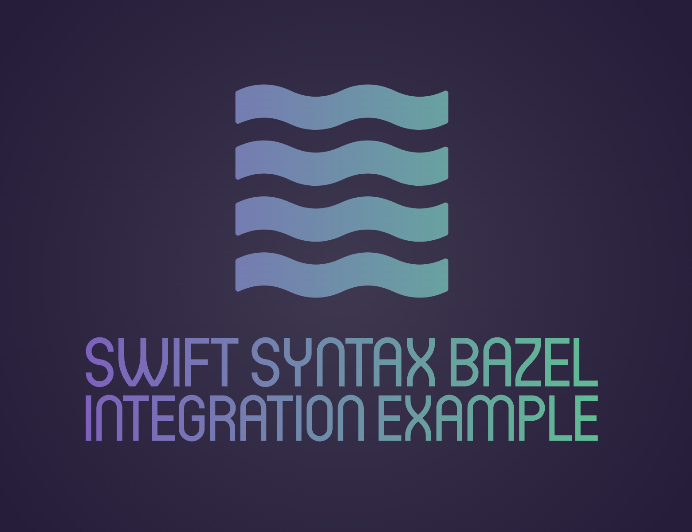
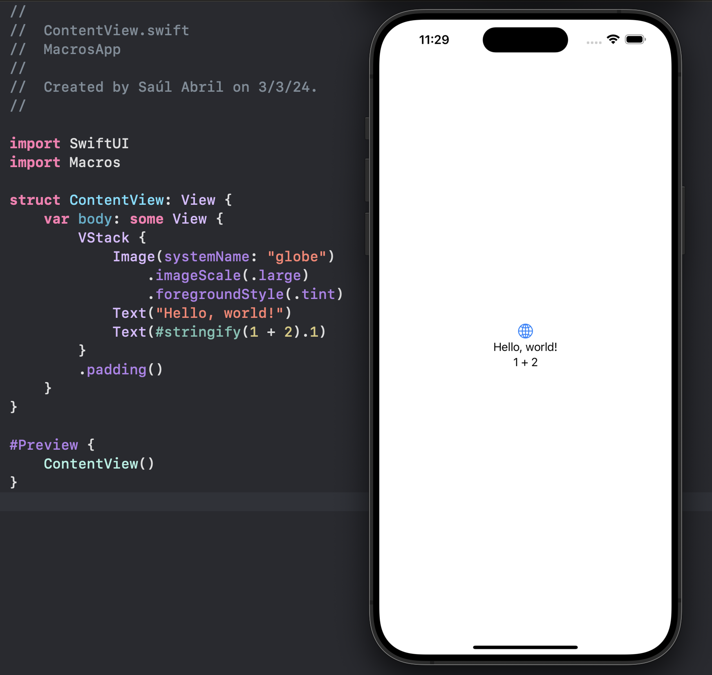

<a name="readme-top"></a>
<!--
*** Thanks for checking out the Best-README-Template. If you have a suggestion
*** that would make this better, please fork the repo and create a pull request
*** or simply open an issue with the tag "enhancement".
*** Don't forget to give the project a star!
*** Thanks again! Now go create something AMAZING! :D
-->

<!-- PROJECT SHIELDS -->
<!--
*** I'm using markdown "reference style" links for readability.
*** Reference links are enclosed in brackets [ ] instead of parentheses ( ).
*** See the bottom of this document for the declaration of the reference variables
*** for contributors-url, forks-url, etc. This is an optional, concise syntax you may use.
*** https://www.markdownguide.org/basic-syntax/#reference-style-links
-->
[![Contributors][contributors-shield]][contributors-url]
[![Forks][forks-shield]][forks-url]
[![Stargazers][stars-shield]][stars-url]
[![Issues][issues-shield]][issues-url]
[![MIT License][license-shield]][license-url]
[![LinkedIn][linkedin-shield]][linkedin-url]


<!-- PROJECT LOGO -->
<br />
<div align="center">
  <a href="https://github.com/asam139/swift-syntax-bazel-integration-example">
    
  </a>

<h3 align="center">Swift Syntax Bazel Integration Example</h3>

  <p align="center">
    An example how to integrate Macros using SwiftSyntax into Bazel projects
    <br />
    <a href="https://github.com/asam139/swift-syntax-bazel-integration-example"><strong>Explore the docs »</strong></a>
    <br />
    <br />
    <a href="https://github.com/asam139/swift-syntax-bazel-integration-example/issues">Report Bug</a>
    ·
    <a href="https://github.com/asam139/swift-syntax-bazel-integration-example/issues">Request Feature</a>
  </p>
</div>

<!-- TABLE OF CONTENTS -->
<details>
  <summary>Table of Contents</summary>
  <ol>
    <li>
      <a href="#about-the-project">Repository</a>
      <ul>
        <li><a href="#motivation">Introduction</a></li>
        <li><a href="#motivation">Motivation</a></li>
        <li><a href="#structure">Structure</a></li>
        <li><a href="#built-with">Built With</a></li>
      </ul>
    </li>
    <li>
      <a href="#getting-started">Getting Started</a>
      <ul>
        <li><a href="#prerequisites">Prerequisites</a></li>
        <li><a href="#installation">Installation</a></li>
      </ul>
    </li>
    <li><a href="#usage">Usage</a></li>
    <li><a href="#contributing">Contributing</a></li>
    <li><a href="#license">License</a></li>
    <li><a href="#contact">Contact</a></li>
    <li><a href="#acknowledgments">Acknowledgments</a></li>
  </ol>
</details>


<!-- ABOUT -->
## About

An example how to integrate Macros using SwiftSyntax into Bazel projects.

### Introduction

SwiftSyntax serves as a versatile tool in the realm of Swift development, offering a comprehensive set of libraries for parsing, inspecting, generating, and modifying Swift source code. Initially developed by Apple, it has evolved into an open-source project with active contributions from a diverse community. The library's documentation is readily available on [swiftpackageindex](https://swiftpackageindex.com/apple/swift-syntax/510.0.1/documentation/swiftsyntax), complemented by numerous articles in the GitHub readme. Notably, SwiftSyntax forms the backbone for essential tools like the Swift parser and swift-format.

A key aspect of SwiftSyntax's functionality lies in its ability to create an Abstract Syntax Tree (AST) of Swift source code. This AST serves as a high-level, secure, and efficient API, enabling developers to interact with their code in a structured manner. Exploring the Swift AST becomes more accessible through tools such as the Swift AST Explorer.

The landscape of Swift development witnessed a significant enhancement with the introduction of Swift Macros in the WWDC 2023 release of Swift 5.9. Leveraging SwiftSyntax as its foundation library, Swift Macros offer a novel approach to extending Swift by introducing new expressions, facilitating the creation of expressive libraries, and streamlining the elimination of unnecessary boilerplate code.

An intriguing dimension brought forth by Swift Macros is their role in extending the compiler with custom compile-time checks. While some may argue that similar outcomes can be achieved through reusable methods, Swift Macros stand out due to their unique features, making them an exceptional tool in the developer's toolkit.


### Motivation

Swift Macros were introduced as a feature bundled within Swift Packages. This approach enhances shareability. However, it also tightens the reliance on seamless integration between Xcode and the Swift Package Manager (SPM), which, from my experience and that of others, can be less than ideal in **large projects** with **numerous dependencies**.

Given the suboptimal experience offered by Apple’s ecosystem, which precludes optimization opportunities, developers uses external depencencies managers, especially Cocoapods.
Besides they uses build systems as Bazel to automate tasks, compile and execute tests in a deterministic environment.

For such reason the objective of this repository was to check the viability together pros/const of define and integrate Swift Macros into Bazel environment.

### Structure

The repository defines the following parts:

* **MacrosPlugin**:
  * Depends of SwiftSyntax library
    * SwiftCompilerPlugin
    * SwiftSyntaxBuilder
    * SwiftSyntaxMacros
  * Contains macros implementation
  * Define which macros are visible to the compiler

* **Macros**:
  * Depends of MacrosPlugin
  * Public macro declaration which indicates:
    * Macro name
    * Type which contains the implementation of the expansion that our macro actually performs
    * Module where the Type is defined, in our case MacrosPlugin

* **iOS Example App**:
  * Depends of Macros
  * Define examples using the macros 

### Built With

[![Bazel][Bazel-shield]][Bazel-url]
[![SwiftSyntax][SwiftSyntax-shield]][SwiftSyntax-url]


<!-- GETTING STARTED -->
## Getting Started

To get a local copy up and running follow these simple example steps.

### Prerequisites

* Install Bazel - [Instalation Guide](https://bazel.build/install/os-x)
* Xcode 15.0

### Installation

1. Clone the repo
   ```sh
   git clone https://github.com/asam139/swift-syntax-bazel-integration-example.git
   ```
2. Run example app
   ```sh
   bazel run //MacrosApp:xcodeproj
   ```

<!-- USAGE EXAMPLES -->
## Usage

Use this space to show useful examples of how a project can be used. Additional screenshots, code examples and demos work well in this space. You may also link to more resources.

<div align="center">
  
</div>


<!-- CONTRIBUTING -->
## Contributing

Contributions are what make the open source community such an amazing place to learn, inspire, and create. Any contributions you make are **greatly appreciated**.

If you have a suggestion that would make this better, please fork the repo and create a pull request. You can also simply open an issue with the tag "enhancement".
Don't forget to give the project a star! Thanks again!

1. Fork the Project
2. Create your Feature Branch (`git checkout -b feature/AmazingFeature`)
3. Commit your Changes (`git commit -m 'Add some AmazingFeature'`)
4. Push to the Branch (`git push origin feature/AmazingFeature`)
5. Open a Pull Request

<!-- LICENSE -->
## License

Distributed under the MIT License. See `LICENSE.txt` for more information.

<p align="right">(<a href="#readme-top">back to top</a>)</p>


<!-- CONTACT -->
## Contact

Saúl Moreno Abril- [@93sauu](https://twitter.com/93sauu)

Project Link: [Swift Syntax Bazel Integration Example](https://github.com/asam139/swift-syntax-bazel-integration-example)


<!-- ACKNOWLEDGMENTS -->
## Acknowledgments

* [Bazel Swift Plugin Support](https://github.com/bazelbuild/rules_swift/pull/1061)
* [Swift Syntax Documentation](https://swiftpackageindex.com/apple/swift-syntax/510.0.1/documentation/swiftsyntax)
* [Swift AST Explorer](https://swift-ast-explorer.com/)
* [try! Swift NYC 2017 — Improving Swift Tools with libSyntax](https://www.youtube.com/watch?v=5ivuYGxW_3M)
* [Swift Macros Awesome](https://github.com/krzysztofzablocki/Swift-Macros)


<!-- MARKDOWN LINKS & IMAGES -->
<!-- https://www.markdownguide.org/basic-syntax/#reference-style-links -->
[contributors-shield]: https://img.shields.io/github/contributors/asam139/swift-syntax-bazel-integration-example.svg?style=for-the-badge
[contributors-url]: https://github.com/asam139/swift-syntax-bazel-integration-example/graphs/contributors
[forks-shield]: https://img.shields.io/github/forks/asam139/swift-syntax-bazel-integration-example.svg?style=for-the-badge
[forks-url]: https://github.com/asam139/swift-syntax-bazel-integration-example/network/members
[stars-shield]: https://img.shields.io/github/stars/asam139/swift-syntax-bazel-integration-example.svg?style=for-the-badge
[stars-url]: https://github.com/asam139/swift-syntax-bazel-integration-example/stargazers
[issues-shield]: https://img.shields.io/github/issues/asam139/swift-syntax-bazel-integration-example.svg?style=for-the-badge
[issues-url]: https://github.com/asam139/swift-syntax-bazel-integration-example/issues
[license-shield]: https://img.shields.io/github/license/asam139/swift-syntax-bazel-integration-example.svg?style=for-the-badge
[license-url]: https://github.com/asam139/swift-syntax-bazel-integration-example/blob/master/LICENSE.txt
[linkedin-shield]: https://img.shields.io/badge/-LinkedIn-black.svg?style=for-the-badge&logo=linkedin&colorB=555
[linkedin-url]: https://www.linkedin.com/in/asam139/
[product-screenshot]: images/screenshot.png
[Bazel-shield]: https://img.shields.io/badge/Bazel-grey?style=for-the-badge&logo=bazel
[Bazel-url]: https://github.com/bazelbuild/bazel
[SwiftSyntax-shield]: https://img.shields.io/badge/Swift%20Syntax-grey?style=for-the-badge&logo=swift
[SwiftSyntax-url]: https://github.com/bazelbuild/bazel
